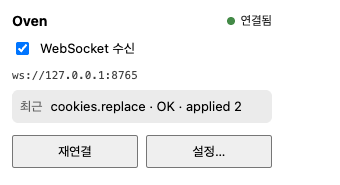
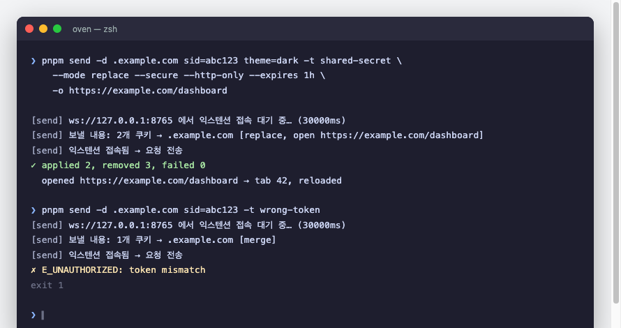
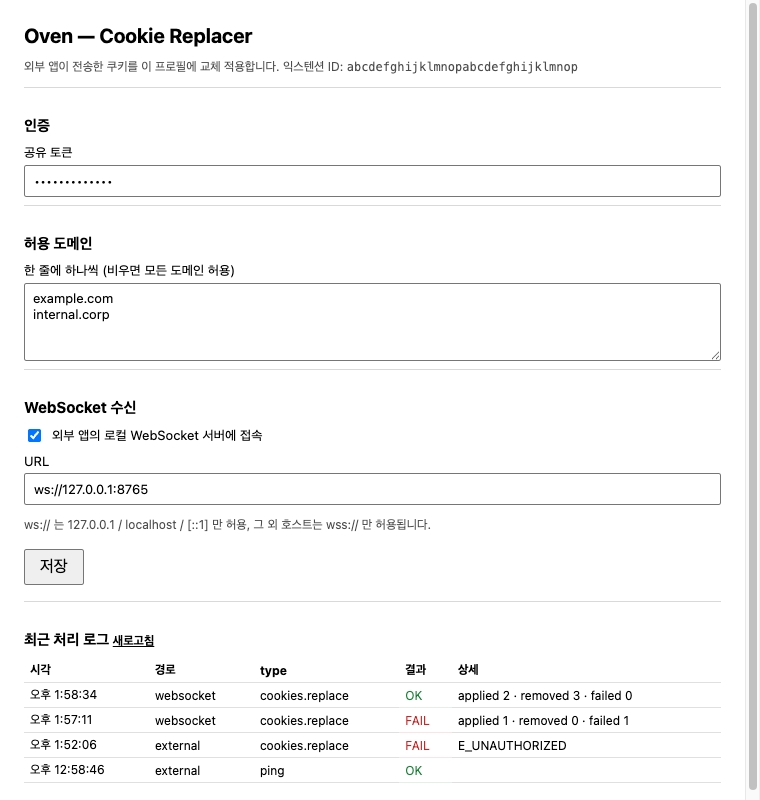

# Oven — Cookie Replacer

외부 애플리케이션(데스크톱 프로그램, 로컬 서버, 웹 앱)이 전송한 쿠키를 받아
현재 Chrome 프로필의 쿠키 저장소에 **교체 적용**하는 Manifest V3 크롬 익스텐션.

[](https://github.com/AndrewJ7823/oven/actions/workflows/ci.yml)
[](https://github.com/AndrewJ7823/oven/actions/workflows/release.yml)
[](https://github.com/AndrewJ7823/oven/releases/latest)
[](#개발)
[](#개발)


- 📦 다운로드: [최신 릴리스](https://github.com/AndrewJ7823/oven/releases/latest) (`oven-vX.Y.Z.zip`)
- 📄 기능 정의서: [`docs/SPEC.md`](docs/SPEC.md)
- 🧪 TDD 가이드: [`docs/TDD.md`](docs/TDD.md)
- 📝 변경 이력: [`CHANGELOG.md`](CHANGELOG.md)

---

## 주요 기능

| 기능 | 설명 |
|---|---|
| 두 가지 수신 경로 | `externally_connectable` 메시지(웹 앱용), 로컬 WebSocket 클라이언트(데스크톱 앱용) |
| merge / replace 모드 | merge: 같은 name·domain·path 쿠키만 덮어쓰기(기본) · replace: 대상 도메인 기존 쿠키 삭제 후 저장 |
| 엄격한 검증 | RFC 6265 쿠키 이름, 도메인 형식, `sameSite`/`secure` 조합, `__Secure-`/`__Host-` 접두어 규칙 |
| 인증 · 허용 목록 | 공유 토큰(상수 시간 비교), 도메인 허용 목록으로 교체 대상 제한 |
| 부분 실패 보고 | 쿠키 단위로 `E_EXPIRED` / `E_SET_FAILED` 수집, 나머지는 계속 처리 |
| dryRun | 실제 저장 없이 검증 결과와 예정 작업 수만 반환 |
| 창 열기 → 주입 → 새로고침 | `open.url` 을 함께 보내면 그 주소로 새 창을 연 뒤 쿠키를 주입하고 해당 탭을 새로고침해 즉시 반영 |
| CLI 로 보내기 (`pnpm send`) | 터미널에서 도메인과 `name=value` 쿠키를 지정해 바로 전송. 토큰·open·모드·만료·dry-run 옵션, 종료 코드로 결과 판별 |
| 툴바 팝업(빠른 제어판) | 아이콘 클릭 시 연결 상태·WebSocket on/off·최근 처리·재연결, 아이콘 뱃지로 상태 표시 |
| 옵션 페이지 | 토큰·허용 도메인·WebSocket 설정, 최근 처리 로그 50건(쿠키 값은 기록하지 않음) |

## 빠른 시작 (5분)

터미널에서 쿠키 하나를 브라우저에 넣어 보는 가장 짧은 경로다. 다른 연동 방식은 [사용법](#사용법)에서 고른다.

**1. Chrome 에 설치한다**

둘 중 하나를 고른다.

- **릴리스 zip (권장)** — [최신 릴리스](https://github.com/AndrewJ7823/oven/releases/latest)에서 `oven-vX.Y.Z.zip` 을 받아 적당한 폴더에 푼다.
- **소스에서 빌드** — `pnpm send` 를 쓰려면 이쪽이 필요하다. Node 22.6+ 와 pnpm 이 있어야 한다.

  ```bash
  git clone https://github.com/AndrewJ7823/oven.git && cd oven
  pnpm install
  pnpm build          # → dist/
  ```

`chrome://extensions` → 우측 상단 **개발자 모드** ON → **압축해제된 확장 프로그램을 로드** → 푼 폴더(또는 `dist/`) 선택.
설치된 버전은 확장 프로그램 카드와 팝업의 `pong` 응답(`version`)에서 확인할 수 있다.

**2. WebSocket 수신을 켠다**

툴바의 **Oven 아이콘**을 클릭해 팝업을 열고 **WebSocket 수신** 토글을 ON 으로 바꾼다.
상태가 *연결 중…* (뱃지 `…`) 으로 바뀌면 준비 완료다. 아직 보내는 쪽이 없으니 연결 중 상태가 정상이다.



> 처음에는 토큰을 비워 둔다(인증 생략). 잘 되는 것을 확인한 뒤 [옵션 페이지](#옵션-페이지)에서 토큰을 설정한다.

**3. 쿠키를 보낸다**

```bash
pnpm send --domain localhost demo=hello --open http://localhost:3000/
```

```
[send] ws://127.0.0.1:8765 에서 익스텐션 접속 대기 중… (30000ms)
[send] 보낼 내용: 1개 쿠키 → localhost [merge, open http://localhost:3000/]
[send] 익스텐션 접속됨 → 요청 전송
✓ applied 1, removed 0, failed 0
  opened http://localhost:3000/ → tab 42, reloaded
```

새 창이 `http://localhost:3000/` 으로 열리고 새로고침되며, 개발자도구 → Application → Cookies 에 `demo=hello` 가 보인다.
팝업의 **최근 처리**에도 한 줄이 남는다. 성공(`✓`)과 실패(`✗`) 출력은 아래처럼 구분된다.



**4. 실전용으로 바꾼다**

```bash
# 로그인 세션 교체: 기존 쿠키 삭제 후 저장, 1시간 만료, secure/httpOnly, 대시보드 열기
pnpm send -d .example.com sid=abc123 --mode replace --secure --http-only --expires 1h \
  -o https://example.com/dashboard -t shared-secret
```

옵션 페이지에서 **공유 토큰**과 **허용 도메인**을 설정하면 `-t` 없는 요청이나 목록 밖 도메인은 거부된다.

**잘 안 될 때**

| 증상 | 원인·해결 |
|---|---|
| `30000ms 안에 익스텐션이 접속하지 않았습니다` | 팝업에서 WebSocket 수신이 OFF 이거나, 옵션의 URL 이 `ws://127.0.0.1:8765` 가 아니다. 팝업의 **재연결**을 누른다 |
| `✗ E_UNAUTHORIZED: token mismatch` | 옵션의 토큰과 `-t`(또는 `OVEN_TOKEN`) 값이 다르다 |
| `✗ E_DOMAIN_NOT_ALLOWED` | 옵션의 허용 도메인 목록에 없는 도메인이다. 목록을 비우면 제한 없음 |
| `✗ E_INVALID_MESSAGE: cookies[0].name …` | 쿠키 이름에 공백·`;`·`=` 가 있다. `--same-site no_restriction` 은 `--secure` 가 필요하다 |
| 창은 열렸는데 쿠키가 안 보인다 | `--secure` 쿠키는 https 페이지에서만 보인다. `--host-only` 와 `.example.com` 형식이 맞는지 확인한다 |
| 뱃지가 `!` (끊김) | 보내는 쪽이 없으면 정상이다. `pnpm send` 를 실행하면 자동 재연결된다 |

## 옵션 페이지

`chrome://extensions` → Oven → **세부정보** → **확장 프로그램 옵션** (또는 팝업의 **설정…**). 상단에 익스텐션 ID 가 표시된다.



| 설정 | 기본값 | 설명 |
|---|---|---|
| 공유 토큰 | 비움 (인증 생략) | 요청의 `token` 과 일치해야 처리한다. 비워 두면 경고가 표시된다 |
| 허용 도메인 | 비움 (제한 없음) | 한 줄에 하나. 요청의 모든 쿠키 도메인이 목록의 도메인 또는 그 하위여야 한다 |
| WebSocket 수신 | OFF / `ws://127.0.0.1:8765` | 켜면 이 주소로 접속을 시도한다. `ws://` 는 loopback 만, 원격은 `wss://` 만 허용 |
| 최근 처리 로그 | — | 최근 50건(시각·경로·결과·오류 코드). 쿠키 값은 기록하지 않는다 |

툴바의 **Oven 아이콘** 팝업은 빠른 제어판이다: 연결 상태, WebSocket 수신 on/off, 최근 처리 1건, 재연결, 설정 열기.
아이콘 뱃지는 연결 중 `…`(노랑), 끊김 `!`(빨강), 연결됨·비활성은 뱃지 없음.

## 사용법

보내는 쪽이 어디인지에 따라 세 가지 경로 중 하나를 고른다. 세 경로 모두 같은 [요청 형식](#요청-형식-공통)을 쓴다.

| 보내는 쪽 | 경로 | 준비 |
|---|---|---|
| 터미널 · 셸 스크립트 · CI | [A. `pnpm send`](#a-터미널에서-보내기-pnpm-send) | 팝업에서 WebSocket 수신 ON |
| 데스크톱 앱 · 로컬 데몬 (Node, Python, Go…) | [B. WebSocket 서버](#b-데스크톱--로컬-프로세스에서-보내기-websocket) | 앱이 `ws://127.0.0.1:8765` 서버를 열고, 팝업에서 WebSocket 수신 ON |
| 웹 페이지 (같은 브라우저) | [C. externally_connectable](#c-웹-페이지에서-보내기-externally_connectable) | manifest 에 오리진 등록 후 재빌드 |

### A. 터미널에서 보내기 (`pnpm send`)

옵션 페이지에서 **WebSocket 수신**을 켜 두면(기본 `ws://127.0.0.1:8765`), 별도 서버 코드 없이 CLI 한 줄로 도메인과 쿠키를 보낼 수 있다.
CLI 가 WebSocket 서버를 열고 → 익스텐션이 접속하면 요청을 보내고 → 응답 요약을 출력한 뒤 종료한다.

```bash
# .example.com 에 sid, theme 쿠키 주입 (merge)
pnpm send --domain .example.com sid=abc theme=dark --token shared-secret

# 기존 쿠키 삭제 후 교체 + 대시보드 창 열어 새로고침, 1시간 만료, secure/httpOnly
pnpm send -d .example.com sid=abc --mode replace --secure --http-only --expires 1h \
  -o https://example.com/dashboard -t shared-secret

# Cookie 헤더 문자열 그대로 / JSON 파일 / stdin
pnpm send -d .example.com --cookie-string "sid=abc; theme=dark"
pnpm send -d .example.com --json cookies.json
cat cookies.json | pnpm send -d .example.com --json - --dry-run

pnpm send --help   # 전체 옵션
```

`cookies.json` 은 쿠키 배열이면 된다. 항목에 `domain`·`secure` 등을 적으면 그 값이 공통 플래그보다 우선한다.

```json
[
  { "name": "sid", "value": "abc123", "secure": true, "httpOnly": true },
  { "name": "theme", "value": "dark", "domain": "app.example.com", "hostOnly": true }
]
```

```
[send] ws://127.0.0.1:8765 에서 익스텐션 접속 대기 중… (30000ms)
[send] 보낼 내용: 1개 쿠키 → .example.com [replace, open https://example.com/dashboard]
[send] 익스텐션 접속됨 → 요청 전송
✓ applied 1, removed 3, failed 0
  opened https://example.com/dashboard → tab 42, reloaded
```

| 옵션 | 설명 |
|---|---|
| `-d, --domain <host>` | 쿠키 도메인(필수). `--json` 항목에 `domain` 이 없을 때 기본값 |
| `name=value …` / `--cookie-string` / `--json <file\|->` | 쿠키 입력(하나 이상). `--json` 은 배열 또는 `{ "cookies": [...] }` |
| `--path`, `--secure`, `--http-only`, `--host-only`, `--same-site` | 모든 쿠키에 적용되는 공통 속성 (기본 `/`, false, false, false, `lax`) |
| `--expires <N\|Ns\|Nm\|Nh\|Nd\|ISO8601>` | 만료. 숫자/접미어는 지금부터 상대 시간. 생략 시 세션 쿠키 |
| `-t, --token` (또는 `OVEN_TOKEN`) | 공유 토큰 |
| `-o, --open <url>`, `--no-focus` | 창 열기 → 주입 → 새로고침 |
| `--mode merge\|replace`, `--dry-run`, `--request-id` | 요청 옵션 |
| `--host`, `--port`, `--timeout <ms>` | 서버 바인딩(익스텐션 옵션의 URL 과 일치)·대기 시간(기본 30000) |

종료 코드: `0` 성공 · `1` 익스텐션이 실패 보고 · `2` 인자 오류 · `3` 접속/응답 시간 초과.
쿠키 값은 출력하지 않지만 **셸 히스토리**에는 남으므로, 민감한 값은 `--json -` 로 stdin 으로 넘기는 편이 안전하다. Node 22.6+ 필요.

### B. 데스크톱 / 로컬 프로세스에서 보내기 (WebSocket)

익스텐션은 서버를 열 수 없으므로 **외부 앱이 WebSocket 서버**(`ws://127.0.0.1:8765`)를 열고,
옵션 페이지에서 **WebSocket 수신**을 켠다. 익스텐션이 클라이언트로 접속하면 같은 JSON 을 텍스트 프레임으로 주고받는다.

- 익스텐션은 20초마다 `{"type":"ping","requestId":"hb-N"}` 하트비트를 보낸다 → 서버는 `{"type":"pong"}` 으로 응답
- 연결이 끊기면 1s → 2s → 4s … 최대 30s 지수 백오프로 재연결
- `ws://` 는 loopback(127.0.0.1 / localhost / [::1])만 허용, 원격 호스트는 `wss://` 만 허용

예제 서버로 바로 확인:

```bash
pnpm ws:example --token shared-secret
```

### C. 웹 페이지에서 보내기 (externally_connectable)

`public/manifest.json` 의 `externally_connectable.matches` 에 보내는 쪽 오리진을 등록하고 다시 빌드한다.
(기본값은 `http://localhost/*`, `http://127.0.0.1/*`)

```js
const EXTENSION_ID = '...' // 옵션 페이지 상단
const res = await chrome.runtime.sendMessage(EXTENSION_ID, {
  type: 'cookies.replace',
  requestId: crypto.randomUUID(),
  token: 'shared-secret',
  cookies: [{ name: 'sid', value: 'abc', domain: '.example.com', secure: true, sameSite: 'lax' }],
})
```

### 요청 형식 (공통)

```json
{
  "type": "cookies.replace",
  "requestId": "3f1c…",
  "token": "shared-secret",
  "mode": "merge",
  "options": { "dryRun": false },
  "open": { "url": "https://example.com/dashboard", "focused": true },
  "cookies": [
    {
      "name": "session_id",
      "value": "abc123",
      "domain": ".example.com",
      "path": "/",
      "secure": true,
      "httpOnly": true,
      "sameSite": "lax",
      "expirationDate": 1790000000
    }
  ]
}
```

응답:

```json
{ "requestId": "3f1c…", "type": "cookies.replace", "ok": true, "applied": 1, "removed": 0, "failed": [], "dryRun": false,
  "opened": { "url": "https://example.com/dashboard", "tabId": 42, "reloaded": true } }
```

`{"type":"ping"}` 은 인증 없이 `{"type":"pong","ok":true,"version":"0.1.0"}` 을 반환한다.
오류 코드 전체 목록은 [`docs/SPEC.md` 4.3](docs/SPEC.md#43-오류-코드) 참조.

### 창 열기 → 주입 → 새로고침 (`open`)

요청에 `open.url`(http/https)을 넣으면 익스텐션이 **① 그 주소로 새 창을 열고 → ② 쿠키를 주입한 뒤 → ③ 해당 탭을 새로고침**한다.
새 창은 주입 이전 쿠키로 로드되므로, 새로고침으로 새 세션이 즉시 반영된다.

```js
await chrome.runtime.sendMessage(EXTENSION_ID, {
  type: 'cookies.replace',
  token: 'shared-secret',
  open: { url: 'https://example.com/dashboard' }, // focused 기본 true
  cookies: [{ name: 'sid', value: 'abc', domain: '.example.com', secure: true, sameSite: 'lax' }],
})
// → opened: { url, tabId, reloaded: true }
```

`dryRun` 이면 창을 열지 않고 계획만 보고하며, 인증/도메인 검사에 실패하면 창을 열지 않는다.
창 열기·새로고침(`chrome.windows`, `chrome.tabs.reload`)에는 별도 권한이 필요 없다.

## 개발

```bash
pnpm test            # 단위 테스트 1회
pnpm test:watch      # TDD 루프
pnpm test:coverage   # 커버리지 (core/transports/cli 90% 임계)
pnpm typecheck
pnpm dev             # vite build --watch
pnpm build           # dist/ 생성 (manifest.version 은 package.json 에서 주입)
pnpm package         # dist/ → release/oven-vX.Y.Z.zip
pnpm version:check   # package.json · manifest · (태그) 버전 일치 확인
```

`main` 에 push 하거나 PR 을 열면 [CI 워크플로](.github/workflows/ci.yml)가 타입체크·테스트·빌드·패키징을 돌리고 zip 을 아티팩트로 남긴다.

개발은 **TDD** 로 진행한다. `docs/SPEC.md` 의 FR/AC 번호를 테스트 `describe` 에 명시하고,
실패하는 테스트 → 최소 구현 → 리팩터 순서를 따른다. 자세한 규칙은 [`docs/TDD.md`](docs/TDD.md).

### 구조

```
src/
  core/            트랜스포트 무관 순수 로직 — chrome.* 미의존, 인터페이스 주입
    protocol.ts      요청 스키마 검증 · 정규화 · 응답 타입
    auth.ts          토큰 비교 · 도메인 허용 판정
    replacer.ts      merge / replace 실행
    handler.ts       검증 → 인증 → 허용 목록 → (창 열기 →) 실행 진입점
    navigator-api.ts 창 열기 · 탭 새로고침 주입 인터페이스
    settings.ts      설정 스키마 · 저장소
    activity-log.ts  처리 로그(값 미포함)
    status.ts        연결 상태·뱃지·요약 매핑(팝업용)
  transports/
    external-message.ts   chrome.runtime.onMessageExternal 어댑터
    websocket.ts          WebSocket 클라이언트(재연결 · 하트비트)
  cli/send-request.ts     pnpm send 순수 로직 — 인자 파싱 · 요청 생성 · 세션 · 출력
  background/index.ts     서비스 워커 — 유일하게 실제 chrome.* 를 주입
  options/                설정 · 로그 UI
  popup/                  툴바 아이콘 팝업(빠른 제어판)
test/
  fakes/           FakeCookies · FakeStorageArea · FakeExternalMessageEvent · FakeWebSocket · FakeNavigator
  core/, transports/, cli/   (cli 에는 CLI↔실제 핸들러 통합 테스트 포함)
  cli/version.ts          릴리스 순수 로직 — semver 증가 · CHANGELOG 갱신/추출
scripts/
  send-cookies.mjs        pnpm send 엔트리 (ws 서버 → 순수 로직 주입)
  release.mjs             pnpm release — 버전 올리기 → CHANGELOG → 커밋 → 태그
  check-version.mjs       pnpm version:check — package.json · manifest · 태그 정합성
  package.mjs             pnpm package — dist/ → release/*.zip
  release-notes.mjs       CHANGELOG 섹션 → GitHub Release 본문
  ws-server-example.mjs   외부 앱 역할 예제 서버
  gen-icons.mjs           아이콘 생성
.github/workflows/
  ci.yml                  push/PR: 버전 검사 · 타입체크 · 테스트 · 빌드 · zip 아티팩트
  release.yml             vX.Y.Z 태그: 빌드 · zip · GitHub Release 생성
```

### 처리 흐름

```
외부 앱 ─(sendMessage)─▶ external-message ─┐
외부 앱 ─(WebSocket)───▶ websocket ────────┤
pnpm send ─(WebSocket)─▶ websocket ────────┤
                                            ▼
                               handler: validate → auth → allowlist
                                            ▼
                     (open.url 있으면) chrome.windows.create  ← ① 창 열기
                                            ▼
                     replacer: (replace 모드면 삭제) → chrome.cookies.set  ← ② 쿠키 주입
                                            ▼
                     (open.url 있으면) chrome.tabs.reload  ← ③ 새로고침
```

## 버전 관리 · 배포

버전의 **단일 출처는 `package.json`** 이다. 빌드 시 `manifest.version` 에 주입되고, `pnpm version:check` 가 `public/manifest.json` 및 git 태그와의 일치를 검사한다.
[Semantic Versioning](https://semver.org/lang/ko/) 을 따르며 최초 릴리스는 `1.0.0` 이다.

| 변경 | 올릴 자리 | 예 |
|---|---|---|
| 버그 수정, 문서·내부 정리 | `patch` | 1.0.0 → 1.0.1 |
| 하위 호환되는 기능 추가(새 옵션, 새 요청 필드) | `minor` | 1.0.1 → 1.1.0 |
| 프로토콜·옵션의 호환성 깨지는 변경 | `major` | 1.1.0 → 2.0.0 |

**릴리스 절차** — 로컬에서 준비하고, 태그를 push 하면 GitHub Actions 가 배포한다.

```bash
# 0. 작업 중 변경 사항을 CHANGELOG.md 의 "## [Unreleased]" 아래에 적어 둔다
# 1. 버전 올리기 → CHANGELOG 갱신 → 검사(typecheck·test) → 커밋 → 태그
pnpm release patch          # 또는 minor · major · 1.2.3   (--dry-run 으로 미리보기, --no-verify 로 검사 생략)
# 2. 커밋을 먼저, 태그를 따로 push → 태그 push 가 Release 워크플로를 실행한다
git push origin main
git push origin v1.0.1
```

> 커밋과 태그를 `--follow-tags` 로 한 번에 푸시하면 태그 이벤트가 워크플로를 깨우지 못하는 경우가 있다.
> 그럴 때는 Actions 탭 → **Release** → **Run workflow** 에 태그 이름(`v1.0.1`)을 넣어 수동 실행하면 같은 절차가 돈다.

`v1.0.1` 태그가 올라가면 [Release 워크플로](.github/workflows/release.yml)가

1. 태그 ↔ `package.json` ↔ `manifest.json` 버전 일치 확인
2. 타입체크·테스트·빌드·`pnpm package`
3. `CHANGELOG.md` 의 해당 섹션을 릴리스 노트로 삼아 **GitHub Release** 를 만들고 `oven-v1.0.1.zip` 을 첨부한다.

사용자는 [Releases](https://github.com/AndrewJ7823/oven/releases) 페이지에서 zip 을 받아 설치하면 된다.
Chrome 웹 스토어 자동 게시는 포함하지 않았다. 필요하면 같은 zip 을 [개발자 대시보드](https://chrome.google.com/webstore/devconsole)에 올리거나, 스토어 API 키를 시크릿으로 두고 `release.yml` 에 업로드 단계를 추가한다.

## 보안 메모

- 쿠키 값은 콘솔·로그·스토리지 어디에도 기록하지 않는다.
- 토큰을 비워두면 인증이 생략된다(개발용). 옵션 페이지가 경고를 표시한다.
- `host_permissions: <all_urls>` 는 쿠키 설정 대상을 사전에 제한할 수 없어 불가피하며, 옵션의 허용 도메인 목록으로 보완한다.

## 라이선스

MIT
